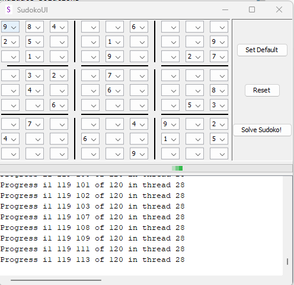
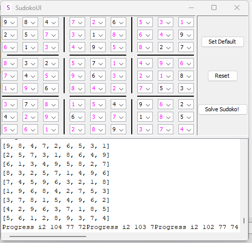
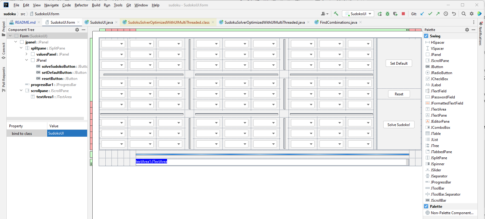
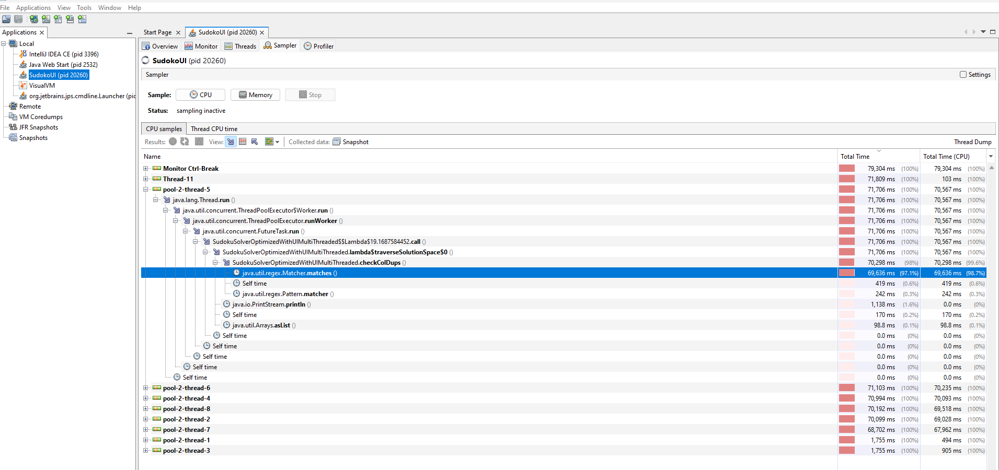
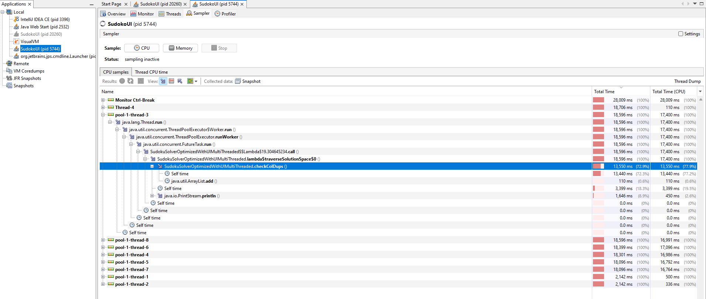

# A not so Simple Brute Force Sudoku Solver in Java

## Background

The motivation behind this project is to showcase certain advanced programming concepts in Java including:
- Using Java **Swing UI** to render the application
- Using **Regular Expressions** and we'll do a little **profiling** while we are at it
- Using **Recursion** to find candidate solutions
- Using **Multithreading** to help expedite the search process

All the while, we will also see that even though we are using brute force to solve this problem, traversing the brute force plane requires a good understanding of Sudoku and even though the algorithm is brute force, it is complicated to solve.

## Sample UI
The following are a couple of screenshots to help demonstrate the application:





The final jar can be downloaded from the release artifacts. Note that it requires Java 8 to run properly.

## Algorithm

Sudoku can be visualized as a 2 dimensional grid, with 9 cells across and 9 cells down. The starting point has a number of prefilled values to give us a starting point. This can be represented below, with `.`s representing unknown values:
```
{
{"9", "8", "4", ".", ".", "6", ".", ".", "."},
{"2", "5", ".", ".", "1", ".", ".", ".", "9"},
{".", "1", ".", ".", "9", ".", ".", "2", "7"},
{".", "3", "2", ".", "7", ".", ".", ".", "."},
{".", "4", ".", ".", "6", ".", ".", ".", "8"},
{".", ".", "6", ".", ".", ".", ".", "5", "3"},
{".", "7", ".", ".", ".", "4", "9", ".", "2"},
{"4", ".", ".", "6", ".", ".", "1", ".", "5"},
{".", ".", ".", ".", ".", "9", ".", ".", "."}
}
```
1. Our first step thus is to infer for every row, what are the "missing" numbers, aka, the numbers that need to be filled in the `.`s. We aren't worried right now about the ordering, just the missing values. This is easy enough to do, we take the numbers 1-9 and remove the numbers already filled - whatever is left must be the missing values.
2. Now that we have the missing numbers, we have to place them in the right ordering. Recall we are using brute force, so this translates to finding all the permutations of the missing numbers for every row. Later we will see how recursion helps us find these permutations. 
3. Next, we apply the numbers that are already prefilled in their locations to the permutations that we created. Permutations need to be applied to the indexes with a blank. We now have every row filled in with values 1-9 guaranteed, with our values in the blank spaces in the row.
4. We now have a solution space, for every row, we have prefilled as well as our generated combination of solutions. We now must take every solution for every row and ensure that the columns line up to 1-9; as well as every 3x3 block also lines us to the numbers 1-9.
5. To achieve the above, believe it or not, we do a nested loop that goes 9 levels deep - one for each row. You might think this is excessive, but as we traverse the space, we do a few things that help expedite the search; in particular, we 
   1. short circuit every time we see a number repeat itself in a column
   2. short circuit on the third and six blocks if the 3x3 grid has a number repeat itself
6. Finally, once we have the results, we short circuit the block and render our UI with the final solution.

## Advanced Java Concepts

In this final section, I talk about some of the advanced Java concepts used in this application:

### Java Swing

Okay, Swing might not be an "advanced" concept - but what I do want to share is the value of being able to produce a rapid prototype. Initially, I had only set to solve the problem using the 2 dimensional array shown above; but without a UI, I thought it was fairly limited.

Sure, you could create a web UI, which would also be pretty straightforward - but think about the data exchange layer. By building the UI in java, we can directly tie into our algorithm without worrying about serializing the data.

Like all good things though, building the UI in Swing does come at a cost:

1. For 1, the algorithm does take time to produce results - as a result, the algorithm itself must be run in a new thread once the "Solve" button is clicked. However, this is pretty easily done:
```
        solveSudokoButton.addActionListener(new ActionListener() {
            @Override
            public void actionPerformed(ActionEvent e) {
                new Thread(new Runnable() {
                    public void run() {
                        ....
                    }).start();
                }
            });
        }    
```
Further, we disable the entire form when running the application; after all, we don't want the user to make changes to the problem he has given us whilst we are solving it.

2. I used Intellij IDEA Community Edition to write this code. They have a module in the IDE that lets you quickly generate the UI using drag and drop features. It isn't really heavily advertised, but is pretty powerful.



### Regular Expressions

I've mentioned a number of times that we needed to check if the columns and 3x3 grids have any duplicate numbers in it. Here is the regular expression that checks to see a character is repeated within itself:
```
Pattern p = Pattern.compile("\\w*(\\w)\\w*\\1+\\w*");
```
This is pretty cool! We are using groups within the same regex to look for repeats!

A note on performance though, this is SERIOUSLY slow. I'm using Jvisualvm; which works pretty nicely to profile the application - see below with regex:



You can see from my sample run that it took roughly 70 secs in the thread doing the pattern match. Whereas if I do a dumb repeat lookup using array comparison:



It goes down to a whopping 13 seconds - roughly making a performance gain of 81%! So whilst it is cool, there are real performance concerns, particularly if batch jobs are being used.

### Use of Recursion to find Solutions

Okay this is pretty cool, recall how in the algorithm we are looking for all the combinations across every row to put in the blanks - how exactly do we get the combinations?

I draw your attention to the following code:

```
    public static void findCombinations(List<String> input, List<List<String>> result, List<String> accumulator) {
        for (int i = 0; i < input.size(); i++) {
            List<String> inputClone = new ArrayList<>();
            inputClone.addAll(input);
            String removedString = inputClone.remove(i);
            List<String> accumulatorClone = new ArrayList<>();
            accumulatorClone.addAll(accumulator);
            accumulatorClone.add(removedString);
            findCombinations(inputClone, result, accumulatorClone);
        }

        if (input.size() == 0) {
            result.add(accumulator);
        }

    }
```

For an input of `[1, 2, 3]` this returns:
```
[[1, 2, 3], [1, 3, 2], [2, 1, 3], [2, 3, 1], [3, 1, 2], [3, 2, 1]]
```
As expected. 

What we are doing is iterating element by element from the input, and putting that element in an accumulator. We take whatever is left and again repeat the process. We keep doing this until we have no more characters left in the input. We finally store this in our result. Once the stack returns, the iterator moves on to the "next" element, which is how we get all perceived combinations.

### Multi-threading
Finally, I draw attention to multi-threading the application. In our case we use an `ExecutorService` that handles the complexity of multi-threading for us. We create our threads from the outer-most loop of our solution space. 

We submit each "job" into our executor service from the outer loop. Because we have a fixed size pool, only a fixed number of threads get spawned, no matter our many combinations of solutions we have in our outer most loop.

```
    private List<List<String>> traverseSolutionSpace(final List<List<List<String>>> solutionSpace) {
        final ExecutorService executor = Executors.newFixedThreadPool(8);
        final List<List<String>>[] solution = new List[]{null};
        for (int i0Out = 0; i0Out < solutionSpace.get(0).size(); i0Out++) {
            final int i0 = i0Out;
            executor.submit(() -> {
                System.out.println("Progress i0 " + i0 + " of " + solutionSpace.get(0).size());
        ....
```
Once we find our solution we invoke `shutdown()` of the `ExecutorService`.

```
...
if (isValidSolution(potentialSolution)) {
        executor.shutdownNow();
        solution[0] = potentialSolution;
        return potentialSolution;
    }
...
```

Finally, we keep wait for the `ExecutorService` to terminate. I give it a timeout of 2 hours, although it might take more for really difficult problems.
```
        try {
            executor.awaitTermination(2, TimeUnit.HOURS);
        } catch (InterruptedException e) {
            throw new RuntimeException(e);
        }
```

I hope this demonstrates how easy it is to manage multi-threading now in Java.